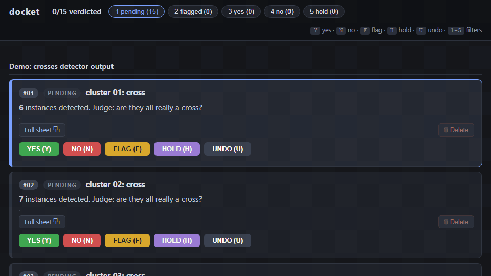
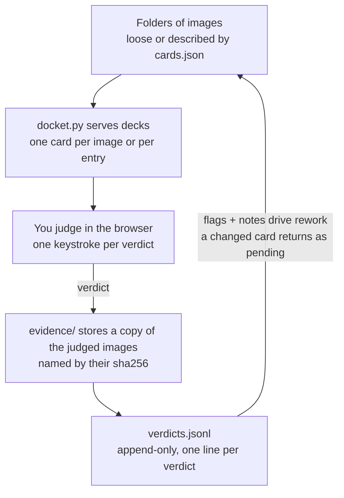

# docket

Your eye is the last filter before a bad image becomes training data. This is
built to make that pass fast.

Look at an image, judge it, say why, and never lose the verdict. One Python
file, stdlib only.

Point it at folders of images (detector output, dataset candidates, screenshots,
render diffs, anything a human needs to judge) and work through them at keyboard
speed: **Y** yes, **N** no, **F** flag, **H** hold, **U** undo. Every verdict
lands in an append-only JSONL log beside a frozen, content-addressed copy of the
exact pixels you judged, and any verdict can carry a note with screenshots
pasted straight into it.



## Quickstart

```
python3 docket.py serve ~/some/folder/of/images
```

Any folder containing images becomes a deck; every image becomes a card. The
GIF above shows the synthetic fixture; `python3 docket.py demo` generates and
serves it.



## Decks and cards

A **deck** is a directory. Two kinds:

- **Loose deck.** A directory of images with no sidecar. One card per image.
- **Described deck.** A directory containing a `cards.json` sidecar. You control
  the cards: labels, summaries, groups of images, links to source documents.

`cards.json`:

```json
{
  "title": "Anchor bolts, batch 12",
  "cards": [
    {
      "key": "a3f9c2e8b1d40767",
      "label": "cluster 04, anchor bolt",
      "summary": "**12** instances, ~21px. Judge: all really anchor bolts?",
      "images": ["cluster-04/zoom.png", "cluster-04/tiles.png"],
      "links": [
        {"label": "Full sheet", "file": "sheets/p03.png"},
        {"label": "Drawing PDF p3", "file": "drawing.pdf", "page": 3}
      ]
    }
  ]
}
```

Field notes:

- `key` is the card's identity. If it is 16 lowercase hex characters it is used
  verbatim; anything else (or a missing key) is hashed together with the deck
  path. **Make the key a content hash of what the card shows** (as the demo
  does) and the id survives re-emitting the deck: an unchanged card keeps its
  verdict, a genuinely changed card gets a fresh id and shows up as pending
  again.
- `summary` is plain text; `` `code` `` and `**bold**` render.
- `images` are inlined on the card, thumbnailed when [Pillow](https://pypi.org/project/pillow/)
  is installed and served whole otherwise. Click any image for full resolution.
- `links` are buttons that open files in a new tab. A `page` number on a PDF link
  deep-links into the browser's PDF viewer (`#page=N`), which works because the
  file is served over http.

Sidecars are discovered at any depth under the roots you pass. A described
deck's subtree is not walked further, so per-card asset folders never become
decks of their own. Hidden directories and `*-data` directories are skipped.
Broken sidecars, missing files, and duplicate ids surface as warnings at the
bottom of the page and in `check`.

## What a verdict writes

All output lands under `--data` (default `./docket-data`), never under your
input roots. The input tree is read-only to this tool.

```
docket-data/
  verdicts.jsonl      # append-only: one line per verdict, fsync'd
  evidence/           # frozen copies of judged images, named by sha256
  note-media/         # screenshots pasted into notes
  deleted.jsonl       # append-only tombstones
  thumbs/             # cache (safe to delete)
```

A verdict line:

```json
{"id": "a3f9c2e8b1d40767", "verdict": "YES", "note": "bolt 3 is a rivet", "ts": "2026-08-01T12:34:56.789-05:00",
 "note_media": ["a3f9c2e8b1d40767-9f2c41d0a7b3.png"],
 "evidence": {"deck": "batch-12", "label": "cluster 04, anchor bolt",
              "images": [{"rel": "batch-12/cluster-04/zoom.png",
                          "sha256": "…", "file": "….png"}]}}
```

Three guarantees, enforced by construction:

1. **The log is append-only.** State is derived by replaying it (last write per
   id wins; `UNDO` retracts). Nothing rewrites or reorders history.
2. **Evidence is frozen at click time.** The exact bytes of every image the card
   showed are copied into `evidence/` under their sha256 before the verdict
   line lands. If the source images later change or vanish, the record of what
   you actually judged survives intact.
3. **Delete is a tombstone.** The trash button (two-step confirm) appends the
   card's id to `deleted.jsonl`; the feed filters it everywhere, and a re-emitted
   card with the same content hash stays hidden. To restore, append
   `{"id": "…", "op": "undelete"}` to the same file. Your own files stay where
   they are.

## Flow

- **Tabs and keys 1 through 5.** Pending, flagged, yes, no, hold. Pending keeps
  deck order with deck headers; verdicted tabs sort most-recent-first.
- **Notes and screenshots.** Every verdict pauses for an optional note, and the
  verdict itself is already saved before the box opens. Paste screenshots
  straight into the note box; they are stored
  server-side in `note-media/` and re-attached when you reload. `Ctrl+Enter` or
  Submit pins the note to the card, `Esc` skips. Writing a note on a card with
  no verdict yet records it as FLAG.
- **FLAG vs HOLD.** Flag means "this needs rework, with my feedback attached."
  Hold means "real, but not now." Both keep the card out of pending while
  leaving it undecided.
- **Undo follows the work.** `U` retracts the focused card's verdict, or, when
  the focused card has none, the last verdict you cast. In the pending view a
  judged card vanishes the moment you key it, so undoing your last call never
  depends on the card still being on screen.
- The page reloads itself when the server restarts (boot-id poll), so
  regenerating decks is just: restart the server, keep the tab.

## CLI

```
python3 docket.py serve [ROOT ...] [--port 8017] [--host 127.0.0.1] [--data DIR]
python3 docket.py check [ROOT ...]        # parse decks, list cards, exit 1 on warnings
python3 docket.py demo  [--dir DIR] [--port 8017]
```

`check` is CI-friendly: it validates every sidecar, resolves every referenced
file, and reports duplicates and missing images without starting a server.

## Tests

```
python3 -m unittest discover -s tests
```

Stdlib only, like everything else. The suite generates the demo fixture, runs a
real server, and exercises verdicts, evidence freezing, tombstones, traversal
guards, and the note-media round trip.

## Non-goals

Annotation geometry (boxes and polygons) and model training are other tools'
jobs. This is the judgment step, in one file you can read in a sitting. The
server binds to localhost by default and trusts its operator, so put it
behind your own auth if you expose it.

## License

MIT
